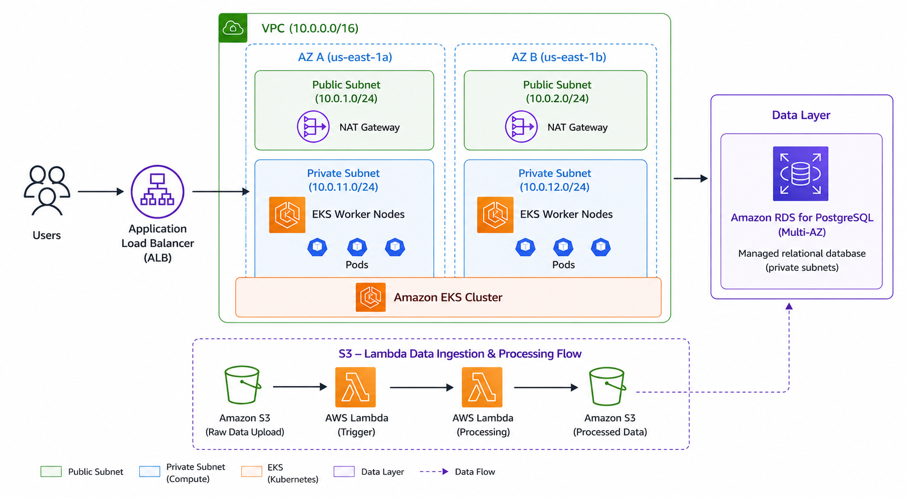

Production-grade microservices infrastructure on AWS EKS for InnovateMart Inc.

## Architecture



## Infrastructure Components

| Component | Technology | Details |
|---|---|---|
| Cloud Provider | AWS | us-east-1 |
| Container Orchestration | Amazon EKS | v1.34 |
| Networking | Amazon VPC | 2 AZs, public & private subnets |
| Database (MySQL) | Amazon RDS | MySQL 8.0, db.t3.micro |
| Database (PostgreSQL) | Amazon RDS | PostgreSQL 16.3, db.t3.micro |
| NoSQL Database | Amazon DynamoDB | On-demand billing |
| Secret Management | AWS Secrets Manager | RDS credentials |
| Object Storage | Amazon S3 | bedrock-assets-4910 |
| Serverless | AWS Lambda | Python 3.12 |
| Observability | Amazon CloudWatch | Container + control plane logs |
| IaC | Terraform | Remote state on S3 |
| CI/CD | GitHub Actions | Plan on PR, Apply on merge |

### Prerequisites
Before deploying, ensure the following tools are installed and configured:

- AWS CLI configured with admin credentials (aws configure)
- Terraform >= 1.6
- kubectl
- helm >= 3
- eksctl

## Deployment Guide
### Initial Deployment (First Time)
Step 1 — Bootstrap remote state S3 bucket (one time only):
```bash
aws s3api create-bucket \
  --bucket project-bedrock-tfstate-4910 \
  --region us-east-1

aws s3api put-bucket-versioning \
  --bucket project-bedrock-tfstate-4910 \
  --versioning-configuration Status=Enabled
```

Step 2 — Deploy all AWS infrastructure:
```bash
- cd terraform
- terraform init
- terraform apply
```

⏱ This takes approximately 20–25 minutes. Resources created include: VPC, EKS cluster, RDS MySQL, RDS PostgreSQL, DynamoDB, Secrets Manager, S3 bucket, Lambda function, IAM roles, and CloudWatch logging.

Step 3 — Run the resume script to complete application setup:
```bash 
chmod +x scripts/resume.sh
./scripts/resume.sh
```
This script automates the following post-infrastructure steps:

- Updates kubeconfig to connect kubectl to the EKS cluster
- Installs the AWS Load Balancer Controller via Helm
- Retrieves RDS credentials from AWS Secrets Manager
- Creates the retail-app Kubernetes namespace
- Recreates Kustomize patch files with live RDS endpoints
- Deploys the retail store application using kubectl apply -k
- Patches Kubernetes secrets with database credentials
- Applies the ALB Ingress resource
- Applies the RBAC ClusterRoleBinding for bedrock-dev-view


### Redeploying After a Destroy (Subsequent Deployments)
If you have torn down the infrastructure with terraform destroy and need to bring it back up:
- Step 1 — Run terraform apply:
``` bash
cd terraform
export AWS_PROFILE=<your-admin-profile>
terraform apply
```

- Step 2 — Run the resume script:
```bash
./scripts/resume.sh
```

⚠️ The resume script handles everything after terraform apply automatically. You do not need to manually run any kubectl or helm commands.


### CI/CD Pipeline
The GitHub Actions pipeline automates all infrastructure changes.
TriggerActionOpen a Pull Request to mainRuns terraform plan and posts the output as a PR comment for reviewMerge PR to mainRuns terraform apply -auto-approve to deploy changes

### Required GitHub Secrets:
SecretDescription
- AWS_ACCESS_KEY_ID
- AWS_SECRET_ACCESS_KEY

⚠️ Never hardcode AWS credentials in workflow files or commit them to the repository.


### Tearing Down Infrastructure
Always run the teardown script instead of terraform destroy directly to avoid VPC dependency errors caused by Kubernetes-managed resources:
```bash
chmod +x scripts/teardown.sh
./scripts/teardown.sh
```

This script:
Deletes the Kubernetes Ingress resource (prevents LB Controller from recreating the ALB)
Finds and deletes the Classic ELB created by the ui LoadBalancer service
Cleans up Kubernetes-managed security groups (k8s-* prefixed)
Waits for AWS to fully release dependent resources
Runs terraform destroy to remove all remaining infrastructure


### Accessing the Application
After deployment, get the application URL:
bashkubectl get ingress -n retail-app

ℹ️ The ALB URL changes each time the infrastructure is redeployed. Always run kubectl get ingress -n retail-app to get the current URL after a fresh deployment.


### Verifying the Deployment
After the resume script completes, verify everything is healthy:
```bash
# Check all pods are running
kubectl get pods -n retail-app
```

### Expected output — all pods should show 1/1 Running
carts, carts-dynamodb, catalog, checkout, checkout-redis, orders, orders-rabbitmq, ui

### Check the ingress is provisioned
kubectl get ingress -n retail-app

## Check CloudWatch log groups are present
```bash
aws logs describe-log-groups \
  --region us-east-1 \
  --query 'logGroups[*].logGroupName' \
  --output table
```

## Test Lambda is working by uploading a file
```bash 
aws s3 cp README.md s3://bedrock-assets-4910/test-file.txt
MSYS_NO_PATHCONV=1 aws logs tail /aws/lambda/bedrock-asset-processor --region us-east-1
```

## Developer Access

The `bedrock-dev-view` IAM user has read-only access to:
- AWS Console (ReadOnlyAccess policy)
- Kubernetes cluster (view ClusterRole)

Verification:
```bash
# Should succeed
kubectl get pods -n retail-app --context bedrock-dev-view

# Should fail
kubectl delete pod -n retail-app --context bedrock-dev-view <pod-name>
```

## Observability

Logs are available in CloudWatch under:
- `/aws/eks/project-bedrock-cluster/cluster` — Control plane logs
- `/aws/containerinsights/project-bedrock-cluster/application` — Application logs
- `/aws/lambda/bedrock-asset-processor` — Lambda function logs

## Resource Tagging

All resources are tagged with:
Project: karatu-2025-capstone